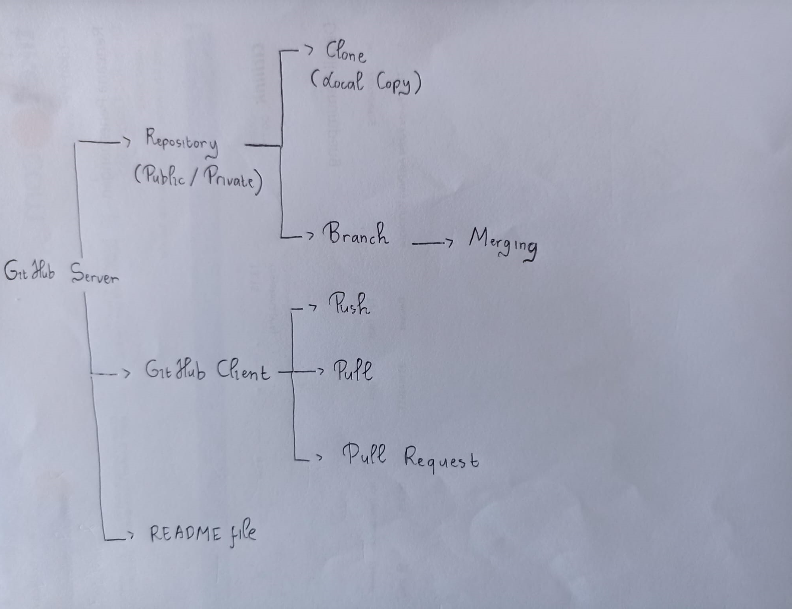

### Question 0

*  Draw a concepts diagram that uses all the following Github terminology 
   * Include any missing keywords that will simplify the concepts diagrams 


`Push`, `Repository`, `Clone`, `Pull`, `Pull Request`, `Branch`, `Merging`, `Github Client`, `README file`, `Private or Public`

```{r}
# The concept of github diagram is presented below
```



#### Question 1

`matrix(c(1,2,3,4,5,6) , nrow = 3)`

* Running the expression produces the following matrix

|  |  |
|---|---|
| 1 | 4 |
| 2 | 5 |
| 3 | 6 |

* How can you modify the call to `matrix()` to produce the following matrix instead?

|   | col_1 |  col_2 |
| --- |---|---|
| row_1 | 1 | 2 |
| row_2 | 3 | 4 |
| row_3 | 5 | 6 |

* Note that you need to name the columns (col_1 and col_2) and name the rows (row_1, row_2, row_3)

Hint: Use the `?` symbol to invoke the matrix documentation

```{r}
matrix(c(1, 2, 3, 4, 5, 6), nrow = 3)
matrix(c(1, 2, 3, 4, 5, 6), nrow = 3, dimnames = list(c("row_1", "row_2", "row_3"), c("col_1", "col_2")))
```

#### Question 1

`matrix(c(1,2,3,4,5,6) , nrow = 3)`

* Running the expression produces the following matrix

|  |  |
|---|---|
| 1 | 4 |
| 2 | 5 |
| 3 | 6 |

* How can you modify the call to `matrix()` to produce the following matrix instead?

|   | col_1 |  col_2 |
| --- |---|---|
| row_1 | 1 | 2 |
| row_2 | 3 | 4 |
| row_3 | 5 | 6 |

* Note that you need to name the columns (col_1 and col_2) and name the rows (row_1, row_2, row_3)

Hint: Use the `?` symbol to invoke the matrix documentation

```{r}
matrix(c(1, 2, 3, 4, 5, 6), nrow = 3)
matrix(c(1, 2, 3, 4, 5, 6), nrow = 3, dimnames = list(c("row_1", "row_2", "row_3"), c("col_1", "col_2")))
```

#### Question 2

* Load then sort the airquality data frame on its `Temp` and `Solar.R` columns in reverse order (largest to smallest values)
  * The function to sort a data frame is called order
* Display only the first 15 lines of your table

```{r}
data("airquality")
airquality
sorted_airquality_temp<-airquality[order(-airquality$Temp),]
sorted_airquality_temp
sorted_airquality_solar.R<-airquality[order(-airquality$Solar.R),]
sorted_airquality_solar.R
sorted_airquality_temp_solar.R <- airquality[order(-airquality$Temp,-airquality$Solar.R),]
sorted_airquality_temp_solar.R
head(sorted_airquality_temp_solar.R,15)
```

#### Question 3

* Sort the airquality data frame on its `Temp` in decreasing order and `Solar.R` in increasing order
* Display only the first 15 lines of your table

```{r}
sorted_airquality_temp_dec<-airquality[order(-airquality$Temp),]
sorted_airquality_temp_dec
sorted_airquality_solar.R_inc<-airquality[order(airquality$Solar.R),]
sorted_airquality_solar.R_inc
sorted_airquality_temp_solar.R_dec_inc<-airquality[order(-airquality$Temp,airquality$Solar.R),]
sorted_airquality_temp_solar.R_dec_inc
head(sorted_airquality_temp_solar.R_dec_inc,15)
```

#### Question 4

* There are various ways to select a subset of observations from a data frame.

* Consult your [R Reference Card](https://cran.r-project.org/doc/contrib/Baggott-refcard-v2.pdf), see `Data Selection and Manipulation` section.
  * What operations can you use to select all observations where the temperature is 72. Give at least two different answers to this question


```{r}
select72<-airquality[airquality$Temp==72,]
select72
choice72<-subset(airquality,Temp==72)
choice72
```

#### Question 6

* You may have noticed when working with the `airqulity` data that some values show as `NA`
 * `NA` stands for not available, or missing values.
* A major part of data wrangling consists of cleaning missing values by either:
  * Dropping the lines that have missing values
   * Sometimes we can drop the column with missing values if the column is made of predominantly missing values
  * Imputing the missing values, which uses educated guesses (or more complex algorithms) to fill the missing values
  
* Find and remove all rows that are missing values for the `Solar.R` or `Ozone` variables
* Save the cleaned data to a new data frame called airquality_no_na
  * How many lines have been removed?

```{r}
missing_rows_Solar.R_Ozone <- is.na(airquality$Solar.R) | is.na(airquality$Ozone)
missing_rows_Solar.R_Ozone
airquality_no_na <- airquality[!missing_rows_Solar.R_Ozone,]
airquality_no_na
lines_removed <- sum(missing_rows_Solar.R_Ozone)
lines_removed 
```

#### Question 7
* Let's use a different strategy and impute the missing value.
  * replace the missing values for Solar.R using that month's average.
  * Example:
    * The missing value for line 6 should be replaced with the average for month 5.
    * The missing value for line 97 should be replaced with the average for month 8.

```{r}
# Write your answer here
```

